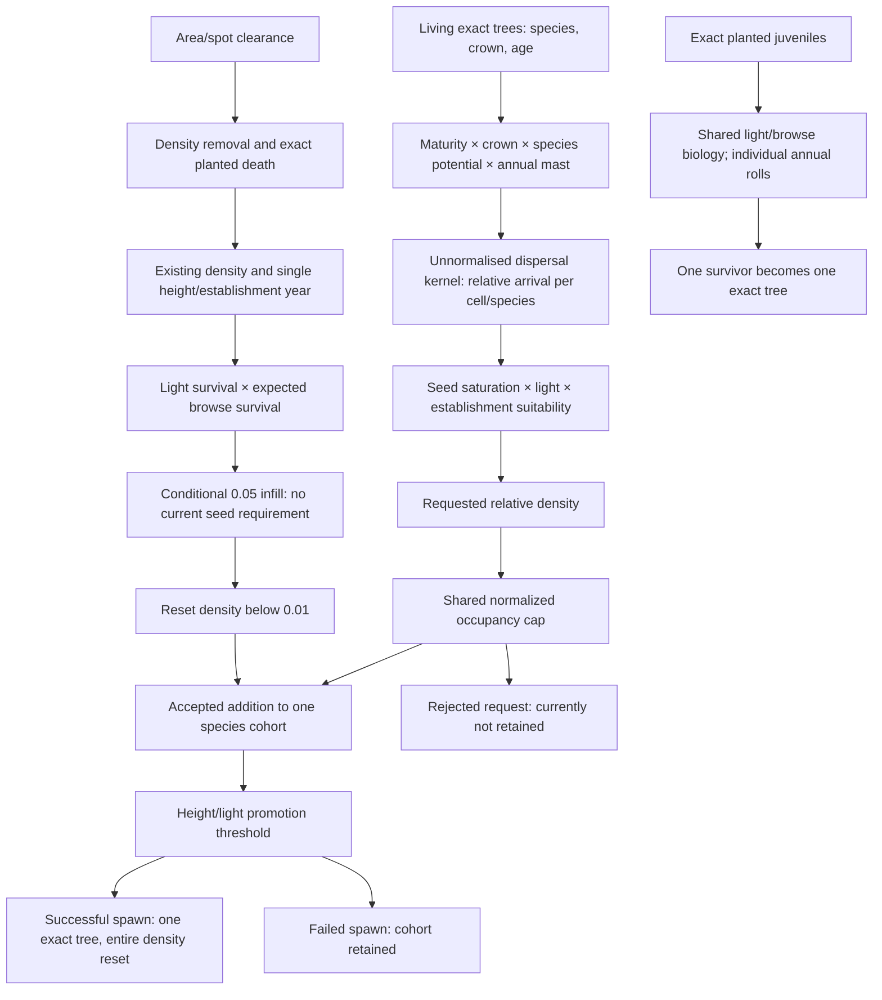

# Regeneration flow — current-main source trace

Base: 402a2b41108dc9aa91e225db9047956b0a91a97e. Context: 691dd18a56c0da21cb08909e22ac0d0625d556b1. Branch: task/regeneration-population-budget. Source inspection, not a new runtime reproduction. No production changes.

Annual order: competition → canopy → adult growth → crown relaxation → canopy → existing regeneration growth/survival/infill → mast → seed rain → establishment → promotion → suitability smoothing → opening decay. This order means infill happens before the current year's arrival is even computed.

| Transition | Input/output and unit | Owner | Random domain | Limit, loss, gain | Persisted state |
|---|---|---|---|---|---|
| Adult seed potential | Age/crown/species → relative source intensity | ForestEcologyController.ComputeSpeciesSeedRain | Annual mast: default RNG seed/year/domain 0; other species isolated MAST hash | Maturity/crown clamps and mast; no viable-seed count | Tree state saved; potential rebuilt |
| Arrival | Source intensity × exp(-distance/scale) → relative cell intensity | ComputeSpeciesSeedRain | None after mast | Cutoff radius; kernel not normalized over cells, so summing arrivals is not conserved physical seed transport | SeedRain rebuilt, not persisted |
| Existing juvenile growth | Height → increased metres | GrowExistingRegeneration / JuvenileEcologyRules | None for cohorts | Species light/site response; expected browsing reduces increment | Height saved |
| Survival | Relative density → relative surviving density | Same | Cohort expected fractions, no event roll | Light loss then browse extra mortality; sequential float precision matters | Density saved; assessment diagnostic not saved |
| Infill | Existing cohort → up to +0.05 relative density | GrowExistingRegeneration | None | Favourable light conditional; shared capacity; no seed or external stock decrement | Increase folded into Density |
| Small-cohort reset | Positive density <0.01 → zero | GrowExistingRegeneration | None | Numerical representation loss; height/year reset | Reset fields saved |
| Establishment request | Arrival/light/suitability → relative density request | EstablishNewCohorts | None | Response <=0.01 ignored; saturation response times species density contribution | Request not persisted |
| Capacity acceptance | Request + old density → bounded density | ForestEcologyCell.AddDensityWithSharedCapacity | None | Occupancy sum density/species maximum; species order affects admission | Density saved; rejected request not saved |
| Recruitment merge | Addition → same species cohort, same height/year/origin | EstablishNewCohorts | None | Only empty/unestablished natural cohort resets height/year; old cohort attributes retained | One record per species on load |
| Natural promotion | Positive relative density plus height/light → one exact tree | PromoteSpeciesCohorts | Default shared annual RNG after mast; other species PROM domain | Jitter within cell; successful spawn clears all density, height, establishment year | Exact tree saved; cleared cohort state saved; origin/year not explicitly cleared |
| Exact planted survival/promotion | Counted individual → alive/dead or one tree | ScenarioOneManager.AdvancePlantedJuveniles | id/year/seed survival roll; id/browse separate domain; model 1 default | Height/light promotion threshold; promotedTreeId suppresses repeat export | Individual fields saved |
| Clearance | Cohort density × remaining area fraction; exact juvenile alive→false | ScenarioOneClearance.ApplyClearance | None | Includes regeneration competitors; habitat cover zeroed for area treatment; no permanent recruitment ban | Cohorts, individual alive, cover, orders/patches saved |
| Recolonisation | Ordinary annual updates following treatment | Existing ecology/ScenarioOne habitat update | Existing domains | Treatment-year display suppression; subsequent updates resume | Normal world state |

Sources: Assets/ForestPrototype/ForestEcologyController.cs; ForestEcologyCell.cs; JuvenileEcologyRules.cs; ScenarioOne/ScenarioOneManager.cs; ScenarioOneClearance.cs; ForestSaveController.cs; ForestSaveData.cs. Save/load resolves records through GetOrCreateCohort(species), so adding duplicate species records to existing JSON does not preserve age bands: later restores overwrite the same live cohort.
