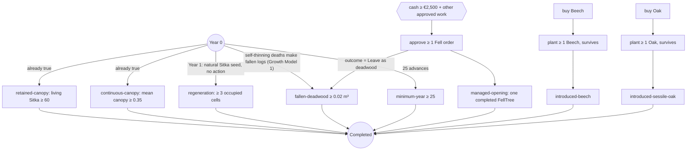
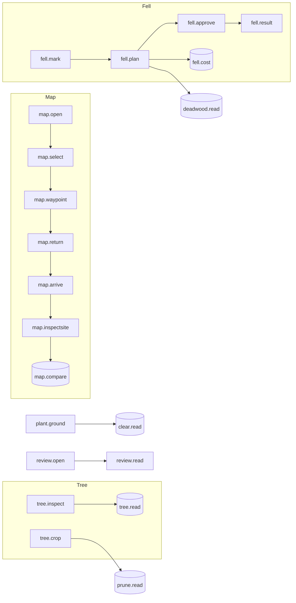

# Objective dependency graph — current main (Workstream A)

**Status:** audit of implemented behaviour at `a8596df` [REPO]. Updates the pedagogy-branch graph (`60674f1`, made at `3e4ee40`) for Growth Model 1.

There are **three** objective-like systems, and they share no prerequisites:

| System | Storage | Scope | Gate? |
|---|---|---|---|
| **L** — Learning checklist (`LearningObjectivesView`, 42 steps in 8 topics) | PlayerPrefs `CCF.Learning.v1.*` | **Device** | Never gates play |
| **F** — Forest objectives (`ScenarioOneObjectives.Evaluate`, 8) | Derived each year from saved snapshots, events and orders | **Forest** | All 8 at Year ≥ 25 → Completed |
| **R** — First Annual Review acknowledgement | Save field `annualReviewSeen` | Forest | Blocks further advances once, after Year 1 |

## 1. F-graph (what completion actually depends on)

Changes since the pedagogy audit (because of D-048):

- **`fallen-deadwood` now also auto-completes.** Growth Model 1 turns each self-thinning death into a fallen-deadwood record (`ScenarioOneManager.OnTreeBiologicalDeath`). Sol's unthinned stand-development run records 2 deaths and 2.2 m³/ha of deadwood by stand age 30 (scenario Year 10). That is about 0.35 m³ on 0.16 ha, against a 0.02 m³ target (`Docs/Research/SitkaGrowthMortality/Evidence/growth_model1_stand_development.csv`). **[INF]** from that run; not re-run here through the completion gate's unmanaged control.
- An **unmanaged** forest at Year 25 therefore probably meets **5 of 8** objectives. Before D-048 it met 4.
- The only objectives that need deliberate action are **one** felled tree and **one** surviving sapling of each broadleaf.

### Hidden prerequisite: the cash gate

`ApprovePendingWork` (`ScenarioOneManager.cs:1111`) refuses approval when total cost exceeds cash. Harvest cost is never below the €2,500 minimum, and timber revenue is not netted at approval. **Timber is the only income.** So a player whose cash falls below €2,500 (plus any other approved work) before completing a first thinning can **never** satisfy `managed-opening`. The game declares failure only at Year 100 (`:2225`). The cash-zero failure (`:2221`) needs cash of exactly €0.00 and so almost never fires. See `PlayerStallPoints.md` S1.

## 2. L-graph (learning) — unchanged structure

Order is enforced only by causality, plus `Requires` on reading steps. Topics: Map (11) → Tree (3) → Felling (5) → Pruning (4) → Deadwood (4) → Planting (7) → Clearance (4) → Plan/Review (4). The HUD "Next lesson" always shows the first unfinished step in list order. A player who has already thinned is therefore still told to practise map steps.

No L-step depends on an F-objective, and no F-objective depends on an L-step. **Nothing links lesson completion to demonstrated forest outcomes.**

## 3. Cross-system dependency table

| Player need | L (teaches) | F (requires) | Linked? |
|---|---|---|---|
| Choose trees to favour | `tree.crop` (any tree) | — | No |
| Thin | `fell.*` | `managed-opening` (one tree) | No |
| Understand cost | `fell.cost` (reading) | — | No. The cash gate is invisible |
| Regeneration | `map.regeneration`, `plant.ground` | `regeneration` (auto) | No |
| Broadleaf planting | `plant.*` | `introduced-*` (mandatory) | No reason given on main |
| Deadwood | `deadwood.*` | `fallen-deadwood` (auto under growth 1) | No |
| Annual Review | `review.*` | R gate (first year only) | Partly |
| Repeat management | — | — | **Missing in both** |

## 4. Consequences for redesign

1. Five objectives measure **state the forest already has, or reaches alone**. They cannot evidence management.
2. The three that need action count **one** act each.
3. The cash prerequisite is real, invisible and irreversible.
4. Learning and completion are parallel systems. A redesign should link them (`ObjectiveRedesign.md`): stage completion should come from **observed decisions in the forest**, not reading or counters.
5. Any F-graph change changes the completion anchor (`D7C4DDD36B53FCCE` for the current stack). It needs explicit authorisation.
