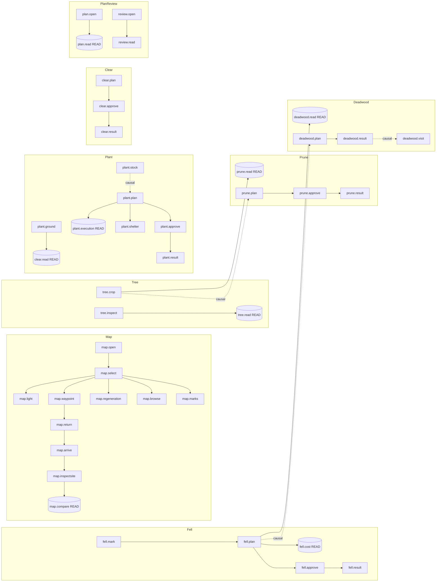
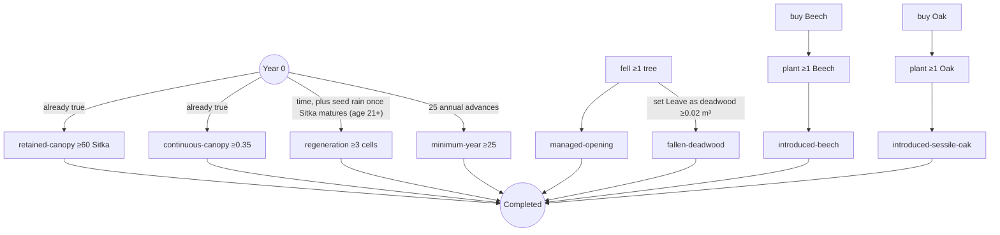

# Scenario One — actual objective graph (Workstream A2)

**Status:** audit of implemented behaviour at `3e4ee40` [REPO]. Not decision authority.

Two independent graphs exist. They share no prerequisites:

- **L-graph:** the device-local learning checklist (`LearningObjectivesView`, 42 steps).
- **F-graph:** the per-forest success objectives (`ScenarioOneObjectives`, 8 objectives).

Neither graph enforces order between topics. The only hard gate in play is the first Annual Review acknowledgement, which blocks *further* year advances until it is given.

## 1. L-graph (learning checklist)

"Requires" exists only on reading steps. Action steps are ordered only by causality: an approval needs an order, and an order needs a mark.

Solid arrows: either an explicit `Requires` (reading steps) or a step that cannot logically happen first. Dotted: causal only (the world state needs the earlier step), not checked by the checklist.

### Step table (prerequisite → behaviour → completion check → suggested next)

| Step | Prerequisite enforced | Player behaviour | Completion check (code) | Next in list |
|---|---|---|---|---|
| map.open | none | press M | `SetScreen(Map)` | map.select |
| map.select | none | click a cell | cell button callback | map.light |
| map.light | none | click Light layer | layer button | map.waypoint |
| map.waypoint | none | Set waypoint | `SetWaypoint` | map.return |
| map.return | waypoint set | close map | `SetScreen(None)` with waypoint | map.arrive |
| map.arrive | waypoint set **away** from start cell | walk into target cell | `WaypointDescription`, distance < half cell, `journeyStartedAway` | map.inspectsite |
| map.inspectsite | arrival | aim at ground in cell or inspect a tree there | same call | map.regeneration |
| map.regeneration / browse / marks | none | click layer | layer button | map.compare |
| map.compare | map.inspectsite | acknowledge | button | tree.inspect |
| tree.inspect | none | E on a living tree | `InspectedTree.IsLiving` | tree.read |
| tree.read | tree.inspect | acknowledge | button | tree.crop |
| tree.crop | none | C on a tree | `LivingCropTreeCount > 0` | fell.mark |
| fell.mark | none | X on a tree | `LivingMarkedCount > 0` | fell.plan |
| fell.plan | none | open Work Plan with a FellTree order | order exists | fell.cost |
| fell.cost | fell.plan | acknowledge | button | fell.approve |
| fell.approve | none | approve | order Approved/Completed | fell.result |
| fell.result | none | open Review with a succeeded FellTree event | event exists | prune.read |
| prune.read | tree.crop | acknowledge | button | prune.plan |
| prune.plan / approve / result | none | batch prune, approve, advance | order/event | deadwood.read |
| deadwood.read | fell.plan | acknowledge | button | deadwood.plan |
| deadwood.plan | none | set Leave as deadwood | order outcome | deadwood.result |
| deadwood.result | none | Review with `TreeRetainedAsDeadwood` | event | deadwood.visit |
| deadwood.visit | none | walk within 6 m of a log | distance | plant.ground |
| plant.ground | none | look at ground | `AimingAtGround` | plant.stock |
| plant.stock | none | buy stock (seen in Work Plan) | StockPurchased event | plant.plan |
| plant.plan | none | G + click | order exists | plant.execution |
| plant.execution | plant.plan | acknowledge | button | plant.shelter |
| plant.shelter | none | Shelters ON on an order | `installShelter` | plant.approve |
| plant.approve / result | none | approve / advance + Review | order/event | clear.read |
| clear.read | plant.ground | acknowledge | button | clear.plan |
| clear.plan / approve / result | none | U, approve, advance + Review | order/event | plan.open |
| plan.open | none | Tab | Work Plan open | plan.read |
| plan.read | plan.open | acknowledge | button | review.open |
| review.open | ≥1 annual report | open Review | screen + report | review.read |
| review.read | none | acknowledge annual results | `AnnualReviewSeen` | — |

## 2. F-graph (forest objectives)

The F-graph has no edges. All eight objectives are evaluated independently every year. Completion needs all eight at once, at any year ≥ 25.

## 3. Findings (A2 checklist)

### 3.1 Accidental or automatic completion

| Item | Kind | Evidence |
|---|---|---|
| retained-canopy, continuous-canopy | Met at Year 0 with no action | Start: 336 Sitka, mean canopy 0.951 [HARNESS `Evidence/residual-stand.json` baseline] |
| regeneration ≥3 | Met by natural Sitka regeneration with no action, **from Year 1** | Untreated stand: 14 regenerating cells at Year 1, 28 at Year 10, 37 at Year 20 [HARNESS T0, RNG 1 / regeneration 1]; unmanaged control Y25 = 37 [LOG P11]. Sitka maturity starts at age 20, so seed rain begins in Year 1 |
| minimum-year | Met by advancing time | — |
| tree.crop, fell.mark | Met by marks restored from a save, or by any tree | `LivingCropTreeCount > 0` |
| *.plan / *.approve / *.result | Met by historical orders/events when a loaded forest's Work Plan or Review is opened | documented as intended in `Scenario1LearningObjectives.md` |
| plant.ground | Met by the first glance at the ground | `AimingAtGround` |
| All L-steps | Met on a new forest if previously done on the device | PlayerPrefs |

### 3.2 Satisfiable before introduced

- Every forestry action (X, C, U, G, Tab) is available from frame 1. The HUD introduction lists M/Tab/O/F1 and E, but not X/C/U/G. The HUD prompt reveals X/C on the first tree aim, and U/G on the first ground aim. So a player can approve a thinning before reading the Tree Inspection or Work Plan introductions (the Work Plan introduction appears on first Tab, so the player at least sees it before approving).
- Forest objectives can be met in any order, without the corresponding lesson.

### 3.3 Counters rather than competence

| Objective/step | Counts | What competence would look like [INF] |
|---|---|---|
| managed-opening | ≥1 felled tree | a released Crop Tree whose meaningful competitors were removed |
| introduced-<sp> | ≥1 planted present | planted where light and seed supply justify it; survival tracked |
| regeneration | ≥3 cells of anything | regeneration of desired species escaping browse |
| fallen-deadwood | ≥0.02 m³ | intentional retention, recorded with a reason |
| tree.crop | any Crop Tree | a Crop Tree chosen after inspection, with competitors identified |
| fell.mark | any Fell mark | a Fell mark justified by its effect on a retained tree |

### 3.4 Mechanics introduced without explanation

- **Treatment forecast** (`If felled now: … growth … gap light … wind peak … opening x of 2`): no lesson or help text explains it.
- **Competition index number (CI)**: no scale is given. The labels (open < 1, moderate < 3, crowded ≥ 3) are hidden thresholds.
- **Wind exposure band** on inspection: never explained.
- **"Recent opening"** (`opening x of 2`) is an internal calibration state, shown raw.
- **Minimum harvest job (€2,500)** is explained in the Work Plan help, but not tied to the decision of *how many trees* to mark. The completion reference thinning of 72 trees earned €483.59 of timber revenue against a €2,500 minimum charge [LOG P2].
- **Seed-bearing state** ("not yet seed-bearing", "maturing"): no lesson links it to regeneration.

### 3.5 Mechanics required without introduction

- **Planting both broadleaf species** is required for completion. Why Beech and Oak, and why they must be planted rather than regenerate naturally, is never stated.
- **Leaving deadwood** is required (0.02 m³). The deadwood lesson exists, but the objective is never linked to it.
- The **25-year minimum** is required, and its reason (CCF is a process) is never stated.

### 3.6 Duplicated teaching

- Approval versus execution is explained in four places: Work Plan help, `plan.read`, `fell.approve`, `plant.approve`. That is acceptable reinforcement, but the wording differs.
- Ground light versus crown light appears in the inspection help, `map.light` and `tree.read`. Consistent.

### 3.7 Dead tutorial text

- `ScenarioOneManager.TutorialHint` numbered steps 1–5 (unreachable while the UI root exists).
- The `ForestTreeMarkingManager.OnGUI` HUD is suppressed whenever a `ScenarioOneManager` exists. Not Scenario One teaching.
- `ForestPlayer` non-scenario prompts (`[F] Chop Tree`, `[Hold U] Pull up … seedlings`, `[R] Cycle species`). Not reachable in Scenario One.

### 3.8 Contradictory instructions

| Conflict | Where |
|---|---|
| "Buy Beech and Sessile Oak saplings" (dead, prescriptive) vs "no specific tree is prescribed" | `TutorialHint` vs learning record |
| Ground preview headed "Clear competing vegetation" lists tree cohorts and saplings, while Work Plan says "Contractor clears competing vegetation… standing trees remain" and Annual Review says "regeneration cohort(s) removed" | `ClearancePreview.Label`, `WorkPlanView.BuildRemoval`, `AnnualReviewView.BuildWork` |
| "Retain original canopy trees" counts recruited Sitka; Century Review counts only P-prefixed plantation trees | `ScenarioOneObjectives` |
| HUD help: "Current objective progress appears in the status panel" (only a count appears) | `MenuHelpView` vs `WalkingHudView` |
| Message "Marked … as harvest" vs prompt "Mark to Fell" vs Work Plan "Thinning job" | marking manager, HUD, Work Plan |
