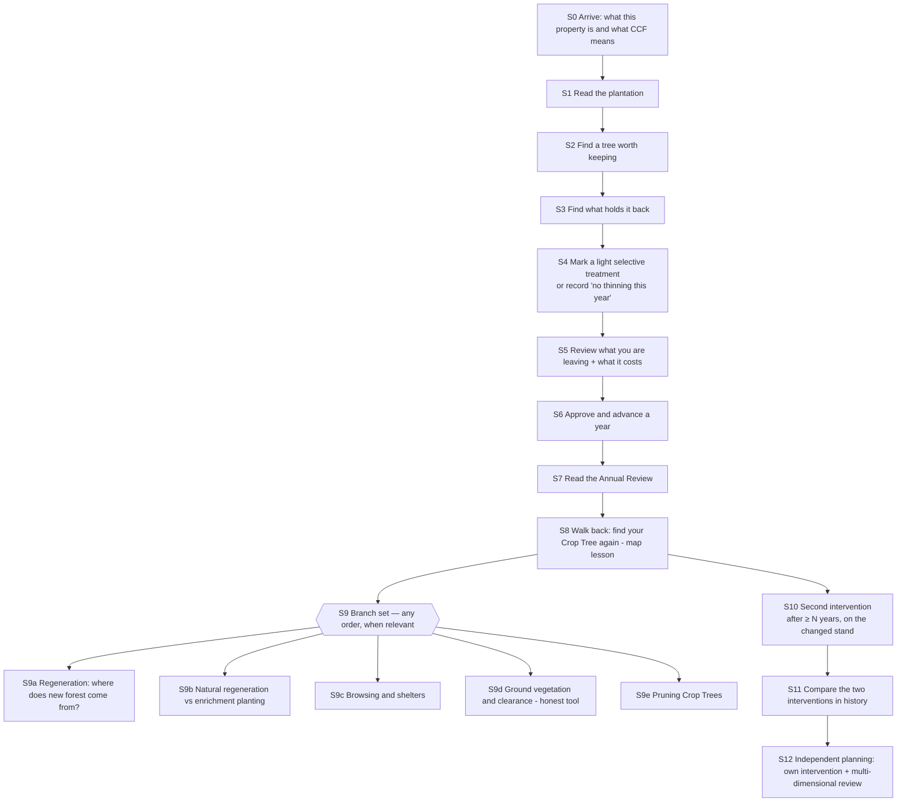

# Scenario One — proposed tutorial arc (Workstream B2)

**Status:** NEW PROPOSAL [INF]. Not accepted. Built on `LearningOutcomes.md` and the audit (`CurrentTutorialAudit.md`).
**Scope:** ordering, framing, completion checks and feedback. It needs **no new ecological variable**. UI and objective changes are listed per stage and grouped into packets in `ImplementationRoadmap.md`.

## 1. Evaluating the packet's draft ordering

The packet suggested 18 stages (0–17). The draft is sound, with five changes:

| Draft | Change | Reason |
|---|---|---|
| Stage 2 "Inspect individual trees" before Stage 3 "trees worth keeping" | **Merge** into one stage: "Find a tree worth keeping" | Inspection is only meaningful with a question attached. The current build teaches inspection in isolation [audit A3 step 4] |
| Map (implicitly early, as now) | **Move the map lesson after Stage 3**, and teach it as "find your Crop Trees again" | The map is 11 of the first 11 current steps, and has no forestry question attached [audit A2] |
| Stage 11–14 as a fixed sequence | **Make 11–15 a branch set** the player can take in any order once regeneration exists | Regeneration, planting, browsing, clearance and pruning depend on what the player's forest shows. Forcing an order would prescribe an answer |
| Stage 16 "Later intervention" near the end | **Tie it to elapsed time**, not to finishing 11–15 | Repeated management is the core lesson (O2). It must happen even if the player skips planting |
| Stage 17 "Independent competence" | **Replace "demonstrate competence" with "plan an intervention and read its multi-dimensional review"** | There is no correct answer to grade (see `MarkingAssessmentFramework.md`) |

## 2. Recommended arc (overview)

Time runs underneath this arc. S0–S7 normally happen in Year 0→1. The branch set opens as the forest gives reasons: regeneration appears from about Year 1, when Sitka seed rain starts as the stand passes age 20 (`maturityOnsetYears` 20 [REPO]). S10 unlocks after a minimum gap — a calibration choice, see §5.

## 3. Stage specifications

Each stage answers the packet's quality-bar questions: **LEARN · DO · STATE · FEEDBACK · SUCCESS · MISTAKE · TEST**. Copy for each stage is in `TutorialCopyBank.md` §2.

### S0 — Arrive

- **LEARN:** what the player owns (a 0.16 ha, 20-year-old Sitka plantation — the stand is 40 × 40 m [REPO]); what CCF means (O1); that this will take decades and many small decisions (O2).
- **DO:** read one short card (3 sentences), then walk.
- **STATE:** none needed.
- **FEEDBACK:** the HUD shows the current stage goal: "Walk in and look at the trees."
- **SUCCESS:** the card is dismissed and the player has moved ≥ 5 m.
- **MISTAKE:** skipping the card. It stays reachable from Help and Lessons.
- **TEST:** the card appears once per *forest* (not per device); it can be reopened; no world change.

### S1 — Read the plantation

- **LEARN:** a plantation is even-aged and crowded; the ground is dark; nothing is regenerating yet, because the trees are only just old enough to cone and the canopy is closed.
- **DO:** look at the ground (ground report) and inspect any one tree.
- **STATE:** ground light (~0.05 at start [LOG P1]); "Regeneration: none"; tree CI label "crowded"; "not yet seed-bearing".
- **FEEDBACK:** the ground "Why" line should name *both* constraints, darkness and no seed source yet. **Current gap:** `ScenarioOneUiFacts.Why` mentions only darkness [REPO]. Fixing it is a copy/presentation change in Packet 1.
- **SUCCESS:** one ground report seen and one tree inspected.
- **MISTAKE:** concluding that the stand needs clearing because it is dark (the clearance preview currently invites this).
- **TEST:** the stage completes only after both actions, and the stage text names both constraints.

### S2 — Find a tree worth keeping (positive selection, part 1)

- **LEARN:** CCF marking starts with the tree you want to *keep* (O4) [PRAC §11.5]. Choose on vigour, crown and space, and say honestly that stem form is not modelled.
- **DO:** inspect 3+ trees and designate one or more Crop Trees (C).
- **STATE:** DBH, height, crown radius (state exists; crown is not shown at present), competition, last-year growth.
- **FEEDBACK:** after C, a short card: "You chose P0912: DBH 22 cm, among the largest here; its crown is limited by close neighbours." Built from authoritative fields, never "good choice" or "bad choice".
- **SUCCESS:** ≥1 Crop Tree that the player inspected before or after marking.
- **MISTAKE:** marking the first tree seen without inspecting. The game notes "You haven't inspected this tree yet" (soft prompt, not a block).
- **TEST:** a Crop Tree restored from a save does not complete the stage for a new forest. Completion requires an inspection event in this forest.

### S3 — Find what holds it back (positive selection, part 2)

- **LEARN:** a competitor is a neighbour that actually takes the Crop Tree's space. Bigger and closer matters; small trees underneath usually take little (O5, O6) [PRAC §11.4, §12.2].
- **DO:** inspect neighbours of a Crop Tree.
- **STATE:** Hegyi term of each neighbour on the Crop Tree — derivable now (`ForestEcologyController.HegyiTerm`, 8 m cutoff) [REPO].
- **FEEDBACK (needs Packet 2):** on inspecting a tree within 8 m of a Crop Tree, show "Competes with your Crop Tree P0912: strong / moderate / slight (rank 1 of 14 neighbours)". This is a relationship statement, not an instruction.
- **SUCCESS:** ≥2 neighbours of a Crop Tree inspected.
- **MISTAKE:** treating the smallest, most suppressed neighbour as the main competitor. This is the "do not clean up" case (`PositiveSelectionTeaching.md`).
- **TEST:** the relationship line appears only for trees within the cutoff of a Crop Tree, and its rank matches a Hegyi recomputation.

### S4 — Mark a light selective treatment

- **LEARN:** a thinning is a set of removals justified by the trees you keep; light and repeated beats heavy and once (O2, O7).
- **DO:** mark Fell (X) on chosen trees, **or** choose "No thinning this year" in the Work Plan (explicit choice, recorded). "Do nothing" is a legitimate option [PRAC §2.10].
- **STATE:** marks; the marking forecast (exists).
- **FEEDBACK:** the forecast line, revised (Packet 2): Crop-Tree release *and* stand-wide change, shown separately. Example: "Your Crop Trees: competition −18 %, growth +9 %. Whole stand: growth +3 %. Light in the opened cells: 0.06 → 0.11."
- **SUCCESS:** a Work Plan with ≥1 Fell order is approved, **or** "No thinning this year" is recorded.
- **MISTAKE:** removing many small stems (T1 in the harness). This shows high removal counts, little Crop-Tree release and a net loss.
- **TEST:** "No thinning" completes S4 but leaves S10 requiring a real intervention later. Fell marks unrelated to any Crop Tree still count (no prescription), but the review reports them as "not near a Crop Tree".

### S5 — Review what you are leaving and what it costs

- **LEARN:** judge a plan by the residual stand as well as the harvest (O3).
- **DO:** open the Work Plan and read the "What you are leaving" block (Packet 3) and the thinning card.
- **STATE:** retained BA/volume; Crop Trees released; cells opened; wind diagnostic; quote (revenue, cost, small-job minimum) — all derivable now (`ResidualStandMetricAudit.md`).
- **FEEDBACK:** multi-dimensional, no single score. The contractor minimum is explained in context: "This visit costs at least €2,500 however few trees you fell. First thinnings of small trees often do not pay for themselves; their value is the trees you leave." The second sentence is practitioner context [PRAC], worded as general experience, not a scenario rule.
- **SUCCESS:** the residual block was visible on screen while the plan had ≥1 Fell order (observed, like current reading steps).
- **MISTAKE:** approving without reading. That is allowed; S5 then stays open as a lesson.
- **TEST:** the residual block figures match the harness recomputation for the same marks.

### S6 — Approve and advance

- **LEARN:** approving commits; advancing executes and grows the forest one year.
- **DO / STATE / FEEDBACK:** as now (well taught).
- **SUCCESS:** first annual report exists.
- **TEST:** existing `MENU_ANNUAL_GATE_PASS` behaviour is preserved.

### S7 — Read the Annual Review

- **LEARN:** connect work with change (O15).
- **DO:** read WORK DONE / MONEY / FOREST; acknowledge (existing gate).
- **FEEDBACK (Packet 5):** a "What to inspect next" list built from authoritative changes, e.g. "Your Crop Tree P0912 grew 0.61 cm (stand mean 0.48 cm)." Facts only.
- **SUCCESS:** existing acknowledgement.

### S8 — Walk back and find your Crop Tree again (map lesson)

- **LEARN:** the map finds places; you judge them on foot.
- **DO:** use the Fell & crop marks layer to set a waypoint to a Crop Tree's cell, walk there, and inspect it.
- **STATE:** existing map, waypoint and inspection.
- **SUCCESS:** existing `map.arrive` + `map.inspectsite`, with the target cell containing a Crop Tree.
- **MISTAKE:** using the map to decide what to cut. The map cannot do it (good), and the lesson text says so.
- **TEST:** waypoint on the current cell does not complete the stage (existing check).

### S9 — Branch set (any order, opened by forest state)

Each branch opens only when the forest gives a reason, and closes when the player has *seen* the issue and made a decision, which may be "not now". Details are in `RegenerationTeaching.md`.

| Branch | Opens when (authoritative) | Core lesson | Success |
|---|---|---|---|
| S9a Regeneration | any cell has Sitka regeneration | where seed comes from; light; abundance is not diversity | player inspected a regeneration cell and opened the Regeneration layer |
| S9b Natural vs enrichment | S9a done | no broadleaf seed source exists here, so planting is the only way Oak/Beech arrive; plant where light allows, not everywhere | planting placed, **or** "not now" recorded |
| S9c Browsing | first broadleaf planting order exists | palatable species are held back by browsing; shelters protect single stems | shelter decision made with cost visible |
| S9d Clearance | player first presses U, or a planted cell holds ground vegetation | clearance removes ground plants **and young trees** in the square; plants regrow; this version does not simulate weed competition on seedlings | player read the explanation before approving a clearance |
| S9e Pruning | a Crop Tree is eligible for a lift | pruning is for knot-free timber, not tree health; no premium yet | lift planned, or "not now" |

### S10 — Second intervention (repeated management)

- **LEARN:** CCF is a cycle. The stand has changed: Crop Trees grew, competitors grew, seed trees matured, light changed (O2, O15).
- **UNLOCKS:** ≥ N annual advances after the first intervention year (calibration, §5).
- **DO:** revisit Crop Trees, re-inspect competitors (ranks will have changed), mark a second treatment.
- **STATE:** all existing. At Year 10 every plantation tree is fully seed-bearing (age 30) [REPO], so "seed source" becomes a real retention consideration in the review.
- **FEEDBACK:** the review compares the *second* plan's residual stand with the first's (Packet 5 history).
- **SUCCESS:** a second intervention year with ≥1 completed FellTree order, at least N years after the first.
- **MISTAKE:** repeating the first plan mechanically, or taking a heavy cut "to finish the job".
- **TEST:** the first intervention cannot satisfy S10 (year check). Approving two jobs in the same year does not count.

### S11 — Compare the two interventions

- **DO:** open history (Packet 5) for the two intervention years.
- **SUCCESS:** viewed.

### S12 — Independent planning

- **LEARN:** O16 — there are several defensible answers.
- **DO:** plan an intervention of the player's own, with no lesson guidance, and read its multi-dimensional review.
- **SUCCESS:** completion is not "passing a grade". The scenario's forest objectives remain separate (see `DecisionMatrix.md` — objective redesign is **PRODUCT DECISION REQUIRED**).

## 4. Relationship to existing systems

| Existing | Proposed treatment |
|---|---|
| 8 learning topics / 42 steps | Keep the step engine (`LearningObjectivesView` observation + PlayerPrefs). Re-sequence into S0–S12. Make stage progress per forest (save field) **or** keep per device — **PRODUCT DECISION REQUIRED**, see `DecisionMatrix.md` row 8 |
| 5 menu introductions | Keep, but shorten the HUD introduction. S0 replaces its first paragraph |
| Annual Review gate | Keep |
| Forest objectives | Unchanged by this arc. Proposed changes are separate (decision paper) |
| Reference Future v1 | Unchanged. Mentioned in S11 as "another forester's path, not the answer" |

## 5. Calibration and decisions this arc needs

| Item | Recommendation | Status |
|---|---|---|
| N — minimum years between interventions for S10 | 5 annual advances. Long enough to see diameter response and regeneration, short enough to keep the tutorial moving. **Not** a forestry return interval: no Swiss/Finnish/Walloon interval is imported | Calibration [D]; PRODUCT DECISION REQUIRED |
| Per-forest vs per-device stage progress | Per-forest stage progress (new save field) plus per-device "seen" flags for help | PRODUCT DECISION REQUIRED (save schema) |
| "No thinning this year" explicit choice | Add as a Work Plan button that records a management event | NEW PROPOSAL (save: event type addition — schema review needed) |
| Ground "Why" naming seed supply | Presentation change only | NEW PROPOSAL |
