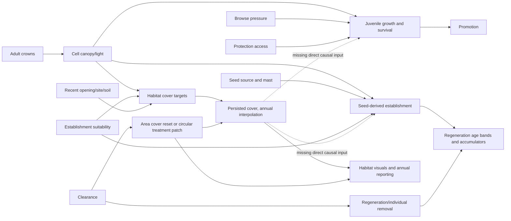

# Current causal graph — source verified

Base/context: StartRecord.md. Runtime reproduction passed for 48 matched cases; the dashed links remain absent in unchanged production.

Proof boundaries: ScenarioOneUnderstorey.Target/Advance; ScenarioOneManager.AdvanceUnderstorey and annual order; ScenarioOneClearance.QueryClearance/ApplyClearance/IsVegetationDisplayCleared; ForestEcologyController establishment/age-band growth; JuvenileEcologyRules; ScenarioOneManager.AdvancePlantedJuveniles. Dashed arrows mark missing connections, not implemented effects.

The candidate programme must test identical light/seed/species/browse/age/capacity with differing cover for Sitka/Oak/Beech and natural/exact-planted adapters. Do not conflate the current removal of tree competitors with a future competition relief from understorey alone. Shelters must modify browsing access independently of vegetation response. No-seed recruitment remains forbidden under regeneration model 1.
