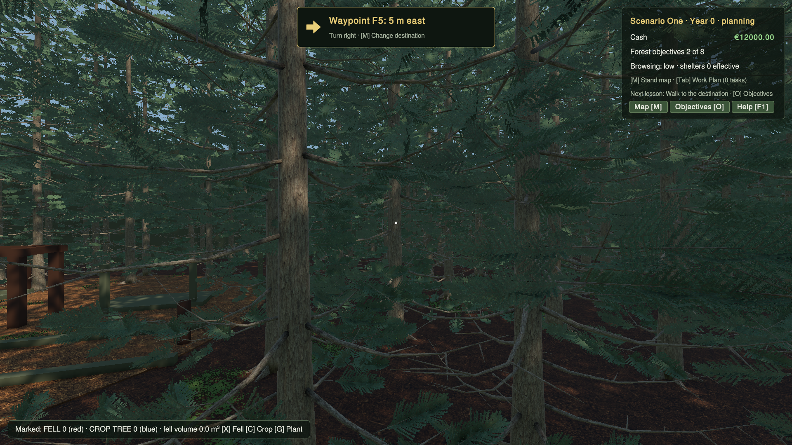
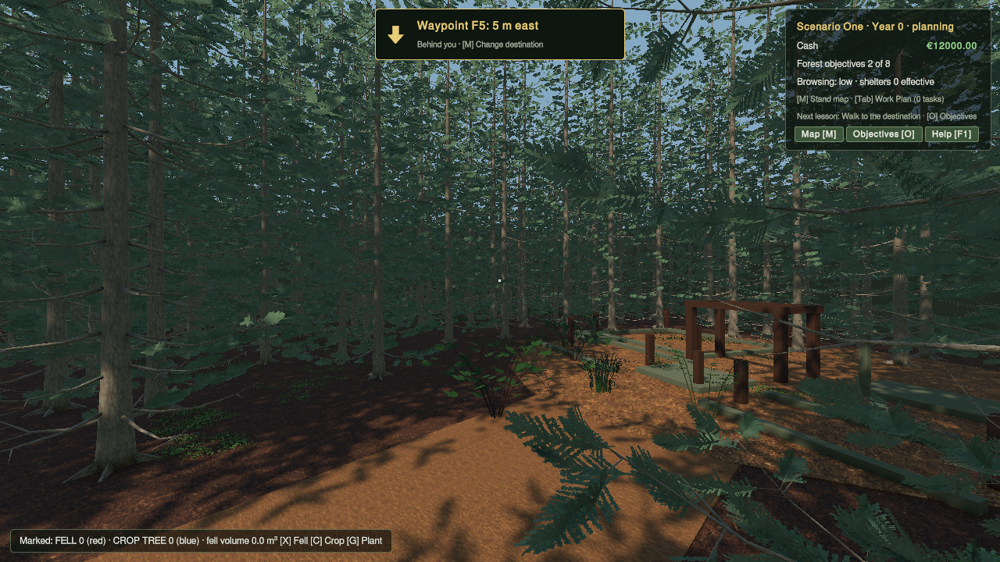
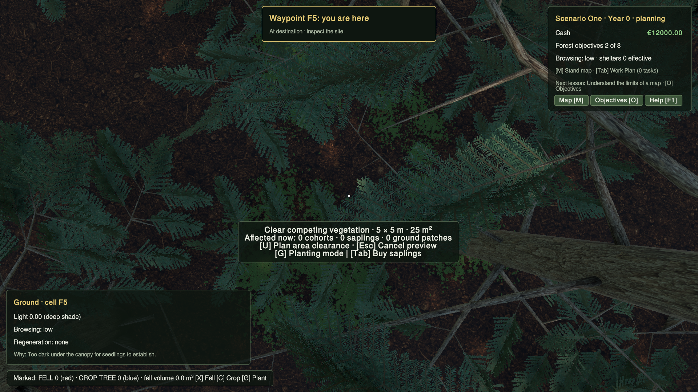

# Waypoint HUD verification

Task branch: `task/scenario-one-menu-tutorial`. Base: `593f4df46f442d691df83d36a8a049bd89eca29d`. Context: `691dd18a56c0da21cb08909e22ac0d0625d556b1`.

The old waypoint label appeared in the isolated baseline; the reported completely missing label was not reproduced. The change gives navigation a dedicated opaque top-center HUD panel showing cell, distance, compass direction and a player-relative vector arrow. Arrival replaces the arrow with an inspection prompt. Clearing removes the panel. The existing scene marker remains. Transient messages move below navigation.

Unity 6000.6.0f1 rendered MenuTutorialVerification passed in 70.98 seconds. The actual map button callbacks select/set/clear a destination; queued M returns to walking. The test checks visible panel bounds at 1280×720, 1600×900 and 1920×1080, bearings and instructions ahead/right/left/behind, unchanged destination and position when turning, arrival and clearing. Arrival uses an explicitly positioned player fixture; it does not claim a physical walking playthrough. Screenshots were visually reviewed for legibility and separation from the status panel. Full menu, learning, annual-review and preference checks also passed. Saved world/profile data are restored by the disposable harness. Physical mouse delivery remains a manual check.

No simulation, save schema, scene/prefab, package or project-settings changes. Earlier simulation/reference gate records remain under Scenario1LearningObjectives; these were not rerun for this presentation change. User settings and seven plant materials were preserved; four known verification-only fungi import changes were restored after Editor exit.

Run from this worktree with Unity closed:

```sh
python3 Tools/Verification/run_clearance_gate.py MenuTutorialVerification --interactive --capture
```

Manual smoke: open this project, enter Scenario One, press M, choose a different map cell, Set waypoint, press M. See the top-center panel; turn and walk toward the destination. At arrival see “you are here”. M → Clear waypoint removes the panel. The HUD should remain clear of inspection/status information.





Source hashes and runtime markers are in results.json. Implemented and verified on the task branch; not merged or pushed.
